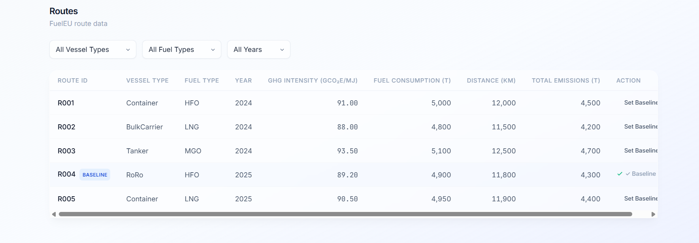
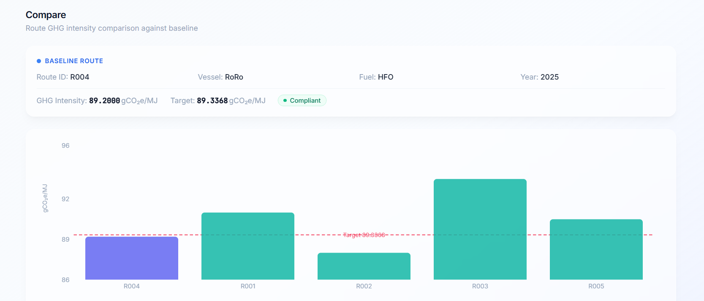
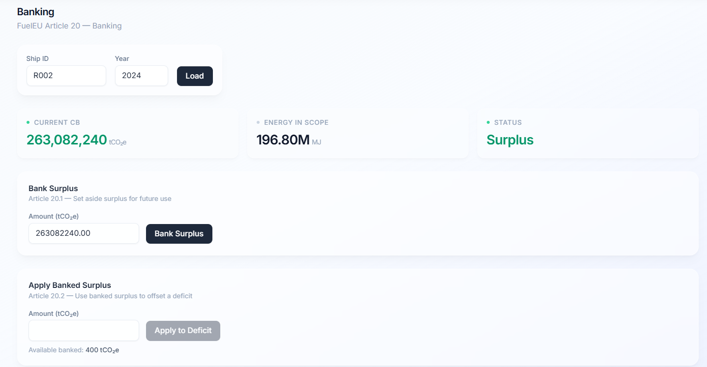
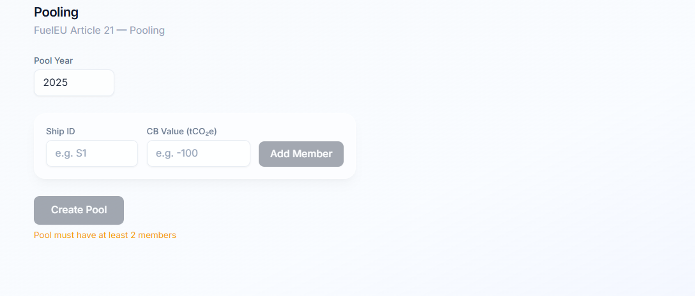

# FuelEU Maritime Compliance Platform

## Overview

A full-stack compliance platform for the **FuelEU Maritime Regulation** (EU 2023/1805). It calculates and tracks the greenhouse-gas intensity of ship voyages, then provides the three core compliance mechanisms defined by the regulation:

- **Compliance Balance (Annex IV)** — computes the GHG intensity of each route against the 2025 target (89.34 gCO₂e/MJ) and determines surplus or deficit.
- **Banking (Article 20)** — allows a ship with a surplus to bank it for future use, or apply previously banked surplus to offset a current deficit.
- **Pooling (Article 21)** — allows two or more ships to pool their compliance balances so that one ship's surplus can cover another's deficit, provided the pool's aggregate CB ≥ 0.

The platform ships as a monorepo with a Node.js/Express backend, a PostgreSQL database, and a React/Vite frontend styled with a glassmorphism design system.

## Architecture

### Hexagonal (Ports & Adapters)

Both the backend and frontend follow Hexagonal Architecture. The core layer contains zero framework imports — pure TypeScript only.

```
┌──────────────────────────────────────────────────┐
│                      CORE                        │
│  domain/      → pure functions + interfaces      │
│  application/ → use-cases (no frameworks)        │
│  ports/       → inbound + outbound contracts     │
└───────────┬─────────────────────────┬────────────┘
            │ implements              │ implements
┌───────────▼───────────┐  ┌─────────▼─────────────┐
│   INBOUND ADAPTERS    │  │   OUTBOUND ADAPTERS    │
│  Express HTTP routes  │  │  PostgreSQL repos      │
│  React hooks + UI     │  │  Axios API client      │
└───────────────────────┘  └───────────────────────┘
```

**Backend:** Express routers (inbound) → Use-case classes → Port interfaces → Postgres repositories (outbound).

**Frontend:** React components → Custom hooks → Port interfaces → Axios API adapters → REST API.

## Tech Stack

| Layer | Technologies |
|-------|-------------|
| Backend | Node.js 20, TypeScript (strict), Express 4, PostgreSQL 15, Jest, Supertest |
| Frontend | React 18, TypeScript (strict), Vite 5, TailwindCSS 3, Recharts 2, Vitest |
| Monorepo | npm workspaces, concurrently |

## Prerequisites

- **Node.js** >= 20
- **PostgreSQL** >= 15 running on `localhost:5432`
- **npm** >= 9

## Setup

### 1. Clone and install

```bash
git clone https://github.com/YOUR_USERNAME/fueleu-maritime.git
cd fueleu-maritime
npm install          # installs root devDeps (concurrently)
cd backend && npm install
cd ../frontend && npm install
cd ..
```

### 2. Database setup

```bash
# Create the database
psql -U postgres -c "CREATE DATABASE fueleu;"

# Copy env file and edit if needed
cp backend/.env.example backend/.env

# Run migrations and seed data (5 sample routes)
npm run db:setup
```

The `.env` file expects these variables (defaults work for local Postgres):

```
DB_HOST=localhost
DB_PORT=5432
DB_USER=postgres
DB_PASSWORD=postgres
DB_NAME=fueleu
PORT=3001
```

### 3. Run in development

```bash
# From repo root — starts both backend (port 3001) and frontend (port 5173)
npm run dev
```

Then open [http://localhost:5173](http://localhost:5173) in your browser.

The Vite dev server proxies `/api/*` requests to the Express backend on port 3001.

### 4. Run tests

```bash
# All tests (backend + frontend in parallel)
npm run test

# Backend only — domain + use-case unit tests (no DB required)
cd backend && npm run test:unit

# Backend integration tests (requires PostgreSQL running)
cd backend && npm run test:integration

# Frontend only — Vitest + React Testing Library
cd frontend && npm run test
```

## API Endpoints

| Method | Path | Description |
|--------|------|-------------|
| `GET` | `/health` | Health check — returns `{ status: "ok" }` |
| `GET` | `/routes` | All routes, with optional `?vesselType=`, `?fuelType=`, `?year=` filters |
| `POST` | `/routes/:id/baseline` | Set a route as the baseline for comparisons |
| `GET` | `/routes/comparison` | Compare baseline route against all others (% diff, compliant flag) |
| `GET` | `/compliance/cb` | Compute compliance balance — `?shipId=R001&year=2024` |
| `GET` | `/compliance/adjusted-cb` | CB after banking adjustments — `?shipId=R001&year=2024` |
| `GET` | `/banking/records` | All bank/apply entries for a ship — `?shipId=R001&year=2024` |
| `POST` | `/banking/bank` | Bank a positive CB surplus — body: `{ shipId, year, amount }` |
| `POST` | `/banking/apply` | Apply banked surplus to a deficit — body: `{ shipId, year, amount }` |
| `POST` | `/pools` | Create a compliance pool — body: `{ year, members: [{ shipId, cb }] }` |

## Core Formulas (FuelEU Annex IV)

| Concept | Formula |
|---------|---------|
| **Target GHG Intensity (2025)** | 91.16 × (1 − 0.02) = **89.3368 gCO₂e/MJ** |
| **Energy in scope** | fuelConsumption (t) × 41,000 MJ/t |
| **Compliance Balance** | (Target − Actual GHG Intensity) × Energy in scope |
| **Surplus** | CB > 0 — the ship emits less than the target |
| **Deficit** | CB < 0 — the ship emits more than the target |
| **Banking (Art. 20)** | A surplus can be banked and applied to a future deficit |
| **Pooling (Art. 21)** | Multiple ships pool their CBs; valid if aggregate CB ≥ 0 |

## Project Structure

```
fueleu-maritime/
├── backend/
│   └── src/
│       ├── core/
│       │   ├── domain/          # Route, Compliance, Banking, Pool, Comparison
│       │   ├── application/     # Use-case classes (RouteUseCases, etc.)
│       │   └── ports/           # Inbound + outbound interfaces
│       ├── adapters/
│       │   ├── inbound/http/    # Express route handlers
│       │   └── outbound/postgres/ # Repository implementations
│       ├── infrastructure/
│       │   ├── db/              # client.ts, migrate.ts, seed.ts
│       │   └── server/          # Express app entry point
│       └── __tests__/           # Jest tests (domain, application, integration)
├── frontend/
│   └── src/
│       ├── core/
│       │   ├── domain/          # TypeScript interfaces (Route, Compliance, etc.)
│       │   └── ports/           # IRoutePort, ICompliancePort, IBankingPort, IPoolPort
│       ├── adapters/
│       │   ├── infrastructure/  # Axios API client + React ApiContext
│       │   └── ui/
│       │       ├── hooks/       # useRoutes, useComparison, useBanking, usePool
│       │       └── components/  # RoutesTab, CompareTab, BankingTab, PoolingTab
│       ├── shared/              # Constants (TARGET_GHG_INTENSITY, VESSEL_TYPES, etc.)
│       └── __tests__/           # Vitest tests (domain, components)
└── package.json                 # npm workspaces root
```

## Screenshots

> **Routes Tab** — Filter by vessel type, fuel type, or year. Set any route as the baseline.



> **Compare Tab** — Bar chart of GHG intensities with the 89.34 target line. Table shows % diff and compliance status.



> **Banking Tab** — Load a ship's compliance balance. Bank surplus or apply banked surplus to a deficit.



> **Pooling Tab** — Add ships to a pool, see real-time validation, and create the pool when the aggregate CB ≥ 0.


